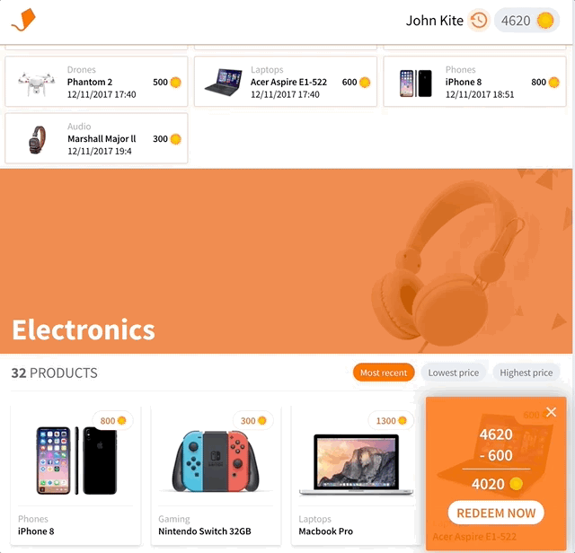
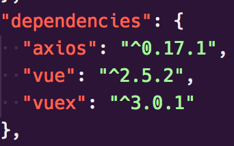

# 👋 Hola mundo!

Este proyecto es el resultado del [Aerolab Coding Challenge](https://aerolab.co/coding-challenge), decidí hacerlo en Vue siemplemente para probarlo, despues de hacer un [workshop de Vue](https://github.com/ianaya89/workshop-vuejs).

[DEMO](https://aerolavue-goncy.surge.sh/)

## Algunos detalles que tomé en cuenta
1. API Helpers simples.
```js
const [user, history, products] = await [
    await api.user.me(),
    await api.user.history(),
    await api.products()
  ]

  this.setUser(user)
  this.setHistory(history)
  this.setProducts(products)
```

2. Estados sincronizados.
> 

3. Responsive y animaciones.
> 

4. Pocas dependencias, solo el framework con su state management y una libreria para los api calls. CSS y maquetado, todo a mano.
> 

5. Adaptabilidad.
> 

6. Edge cases, como intentar de redeemear otro item mientras otro esta en proceso o actualizar el item seleccionado cuando se obtienen mas monedas.
> 

___
### 🗣 Opinión sobre Vue

### Pros
* Bueno para trabajar con animaciones.
* Buena implementación de Flux.
* Buen tooling y ecosistema.
* Buena documentación.
* Facil para prototipar.

### Cons
* Pasar callbacks a componentes anidados, mas de un nivel no es simple.
* Aplicar atributos directamente a un componente importado los sobreescribe (depende del atributo).
* Combinar metodos de Vuex con metodos propios del componente (los metodos de vuex no son usables desde los metodos del componente).

Hay muchas cosas mas para comentar sobre todo esto, pero soy un readme y no un blog post, capaz la próxima!